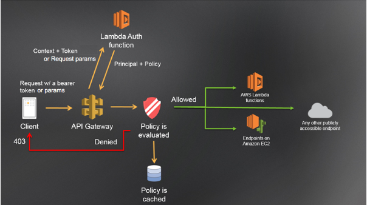
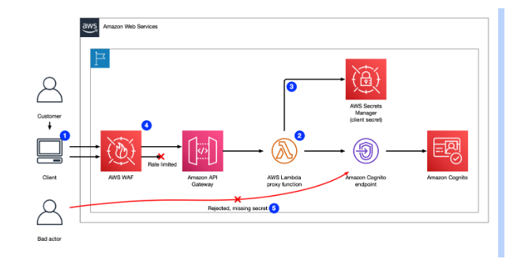
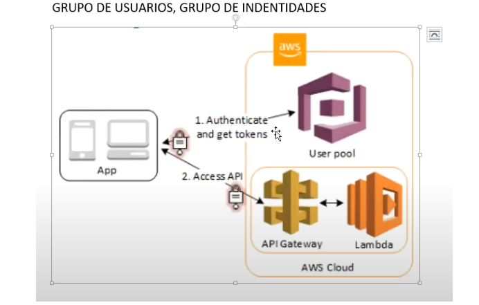

# Proyecto: Infraestructura como Código en AWS

## Descripción

Este proyecto implementa un sistema de infraestructura en la nube utilizando **AWS CDK**. La arquitectura está diseñada para manejar eventos a través de **EventBridge** y ofrece autenticación mediante **Amazon Cognito**.

El sistema incluye tres funciones **AWS Lambda** y una base de datos **DynamoDB** para gestionar pedidos y administrar usuarios.

---

## Componentes del Sistema

### 1. **Autenticación**

- Se utiliza **Amazon Cognito** para la autenticación de usuarios y el control de acceso.
- Los usuarios autenticados pueden interactuar con las funciones Lambda según sus permisos asignados.

---

### 2. **Funciones Lambda**

#### a. **Tienda Don Pedro**

- Identificador: `TiendaDonPedroLambda`
- Permite realizar pedidos de productos disponibles en la tienda "Don Pedro".
- Los datos de los pedidos se almacenan en la base de datos **DynamoDB**.

#### b. **Panadería Familiar**

- Identificador: `PanaderiaFamiliarLambda`
- Permite realizar pedidos de productos disponibles en la tienda "Panadería Familiar".
- Los datos de los pedidos se almacenan en la base de datos **DynamoDB**.

#### c. **Administración de Usuarios**

- Identificador: `AdministracionUsuariosLambda`
- Permite realizar operaciones **CRUD** sobre los usuarios:
  - **Crear**: Añadir nuevos usuarios.
  - **Leer**: Consultar información de usuarios existentes.
  - **Modificar**: Actualizar datos de usuarios.
  - **Borrar**: Eliminar usuarios.

---

### 3. **Base de Datos**

- **DynamoDB**:
  - Almacena la información de los pedidos realizados en ambas tiendas.
  - Gestiona los datos de los usuarios creados, leídos, actualizados y eliminados a través de la Lambda de administración.

---

## Flujo del Sistema

1. Los usuarios se autentican utilizando **Amazon Cognito**.
2. Los eventos se enrutan mediante **EventBridge** para disparar las funciones Lambda correspondientes:
   - Pedidos en **Tienda Don Pedro**.
   - Pedidos en **Panadería Familiar**.
   - Operaciones CRUD de usuarios.
3. La información procesada se almacena en **DynamoDB** para su posterior consulta y administración.

---

## Requisitos

- **AWS CDK**: Para implementar y gestionar la infraestructura.
- **Amazon Cognito**: Para autenticar usuarios.
- **EventBridge**: Para manejar eventos y comunicarse con las funciones Lambda.
- **AWS Lambda**: Para procesar pedidos y administrar usuarios.
- **DynamoDB**: Para almacenamiento de datos.

---

## Implementación

1. Configurar **AWS CDK** con los recursos mencionados.
2. Crear las funciones Lambda con el código necesario para cada operación:
   - Gestión de pedidos (Tienda Don Pedro y Panadería Familiar).
   - Administración de usuarios.
3. Configurar **EventBridge** para enrutar eventos hacia las funciones Lambda.
4. Definir tablas en **DynamoDB** para pedidos y usuarios.
5. Implementar **Amazon Cognito** para gestionar la autenticación.

---

## Arquitectura del Sistema

## Diagrama base

## AWS Cognito

